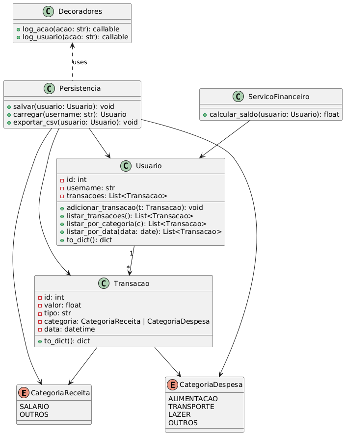

# 💰 Controle Financeiro Pessoal (Python CLI)

Aplicativo de linha de comando desenvolvido em Python para gerenciar finanças pessoais. Permite registrar receitas e despesas, categorizar transações, consultar saldo e exportar relatórios.

---

## 🚀 Funcionalidades

- Registro de receitas e despesas
- Categorização por tipo (ex: Alimentação, Lazer, Salário)
- Listagem de transações por período
- Cálculo automático de saldo
- Exportação de relatórios em CSV
- Armazenamento local em JSON
- Log de ações do usuário

---

## 📊 Diagrama de Classes



---

## 🛠 Tecnologias e Conceitos

- Python 3.10+
- Programação Orientada a Objetos
- Manipulação de arquivos: JSON, CSV
- Manipulação de datas (`datetime`)
- Geradores, decoradores, exceções
- Anotações de tipo (type hints)
- Ambiente virtual (`venv`) para isolamento

---

## 📂 Estrutura do Projeto

```
controle-financeiro/
│
├── data/                      # Armazena os dados persistidos dos usuários em JSON
│   └── usuario_<id>.json
│
├── reports/                   # Relatórios exportados em CSV (gerados pelo sistema)
│   └── transacoes_<username>_<id>.csv
│
├── logs/                      # Arquivos de log com ações do usuário
│   └── acoes.log
│
├── docs/                      # Diagramas e documentação auxiliar
│   └── diagrama_uml.png
│
├── src/                       # Código-fonte principal
│   ├── main.py                # Ponto de entrada da aplicação (CLI)
│
│   ├── models/                # Classes de dados (Entidades)
│   │   ├── __init__.py
│   │   ├── usuario.py         # Classe Usuario
│   │   ├── transacao.py       # Classe Transacao
│   │   └── categoria.py       # Enum de categorias
│
│   ├── services/              # Regras de negócio
│   │   ├── __init__.py
│   │   └── servico_financeiro.py   # Classe com regras de saldo
│
│   ├── persistence/           # Leitura e escrita em arquivos
│   │   ├── __init__.py
│   │   └── persistencia.py    # Salvar/carregar JSON e exportar CSV
│
│   ├── utils/                 # Funções utilitárias e decoradores
│   │   ├── __init__.py
│   │   ├── decoradores.py     # @log_acao e @log_usuario
│
├── .gitignore                 # Ignora arquivos desnecessários
└── README.md                  # Documentação principal do projeto
```

---

## 📦 Instalação

### 1. Clone o repositório
```bash
git clone https://github.com/seuusuario/controle-financeiro.git
cd controle-financeiro
```
### 2. Crie o ambiente virtual
```bash
python -m venv .venv
source .venv/bin/activate     # Linux/Mac
.venv\Scripts\activate        # Windows
```

### 3. Executar
```bash
python src/main.py
```
